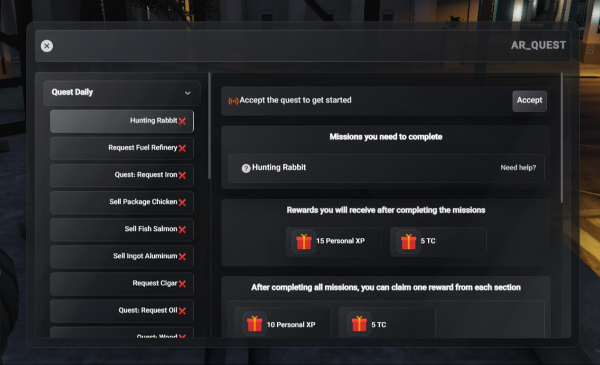
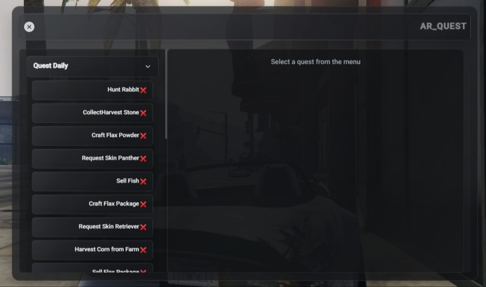

# ⚡ AR_Quest

> **A modern, configurable and multilingual Quest System for FiveM**
>
> Built for clean gameplay, smooth NUI interactions, daily missions, configurable rewards and a polished in-game experience. using /quest command for opening menu





---

## ✨ Overview

**AR_Quest** is a modern FiveM quest system designed to give players a clean and engaging way to discover, accept and complete missions directly from an in-game NUI.

The interface is built around a dark, glass-style design so the game world remains visible behind the menu while players manage their quests.

### What makes AR_Quest different?

- 🎯 Clean and modern quest interface
- 🌍 Full multilingual architecture
- 🇮🇷 Persian support
- 🇬🇧 English support
- 🇸🇦 Arabic support
- 📋 Daily quest system
- 🎁 Configurable XP / reward system
- 🧩 Highly configurable quest definitions
- 🖥️ Modern NUI interface
- 🌙 Dark glass / game-overlay design
- ⚡ Lightweight and gameplay-friendly
- 🔧 Easy configuration and expansion
- 🛠️ Designed for ESX-based FiveM servers

---

## 🖥️ Preview

### Quest Selection

The quest list provides a simple way for players to browse available missions and select the one they want to work on.


### Quest Details & Rewards

After selecting a quest, players can view the required missions and the rewards available after completion.


---

## 🚀 Features

### 🎯 Quest Management

Players can:

- Browse available quests
- Select a quest from the menu
- Accept quests
- View required missions
- Track quest progress
- View quest objectives
- View completion rewards
- Claim available rewards

---

### 📅 Daily Quests

AR_Quest is designed around repeatable quest content such as:

- Hunting
- Collecting
- Harvesting
- Crafting
- Deliveries
- Selling items
- Gathering resources
- Request-based missions
- Animal-related missions
- Farming activities

Quest content can be expanded through the configuration.

---

### 🎁 Reward System

Quest rewards can be configured to fit your server's economy and progression system.

Examples include:

- Personal XP
- TC / server currency
- Item rewards
- Custom rewards

You can define your own reward values and quest requirements inside the configuration.

---

## 🌍 Multilingual System

AR_Quest uses a dedicated language system instead of mixing translations directly into the UI.

### Included languages

| Language | Code | Status |
|---|---|---|
| 🇮🇷 Persian | `fa` | ✅ |
| 🇬🇧 English | `en` | ✅ |
| 🇸🇦 Arabic | `ar` | ✅ |

Language configuration is handled through:

```lua
ConfigLang.Language = "en"
```

Available values:

```lua
"fa"
"en"
"ar"
```

### Translation architecture

The language system is designed to keep:

- Persian text separate from English
- English text separate from Arabic
- Arabic text separate from Persian
- Quest labels translatable
- Quest descriptions translatable
- UI labels translatable
- Notifications translatable

This makes adding another language much easier without rewriting the quest system.

---

## ⚙️ Configuration

AR_Quest separates quest content from the language system.

Typical structure:

```text
AR_Quest/
├── client/
├── server/
├── ui/
├── config.lua
├── configlang.lua
└── fxmanifest.lua
```

### Language

Edit:

```lua
ConfigLang.Language = "en"
```

For Persian:

```lua
ConfigLang.Language = "fa"
```

For Arabic:

```lua
ConfigLang.Language = "ar"
```

---

## 🧩 Quest Configuration

Quest content is configured separately so you can create your own missions without rebuilding the entire resource.

You can customize things such as:

- Quest names
- Quest descriptions
- Objectives
- Required amounts
- Item requirements
- Reward amounts
- XP
- Currency
- Quest categories
- Mission types

Example concept:

```lua
{
    label = "Hunting Rabbit",
    description = "Complete the required hunting mission.",
    reward = {
        xp = 15,
        tc = 5
    }
}
```

> The exact configuration structure may vary depending on your current AR_Quest version.

---

## 📦 Installation

### 1. Download

Place the resource inside your FiveM resources directory:

```text
resources/
└── [scripts]/
    └── AR_Quest/
```

### 2. Add to `server.cfg`

```cfg
ensure AR_Quest
```

### 3. Configure the language

Open:

```text
configlang.lua
```

Set:

```lua
ConfigLang.Language = "en"
```

### 4. Configure quests

Open:

```text
config.lua
```

Customize the quests, objectives and rewards for your server.

### 5. Restart the resource

```text
restart AR_Quest
```

---

## 🎨 UI Design

AR_Quest uses a dark, modern interface designed to work as an overlay on top of the FiveM world.

### Design goals

- Minimal visual clutter
- Strong readability
- Modern glass effect
- Clear quest hierarchy
- Smooth interaction
- Game world remains visible
- Easy navigation

---

## 🔌 Framework

AR_Quest is designed for **FiveM / ESX environments**.

Before installation, make sure your server environment satisfies the dependencies required by your current release.

---

## 🛠️ Developer

**AmirAliJahanBakhsh**

Built with a focus on:

- Clean structure
- Easy configuration
- Expandability
- Localization
- Player experience
- FiveM compatibility

---

## 📁 Recommended Resource Structure

```text
AR_Quest
│
├── client/
│   └── ...
│
├── server/
│   └── ...
│
├── ui/
│   ├── index.html
│   ├── ...
│   └── ...
│
├── config.lua
├── configlang.lua
├── fxmanifest.lua
└── README.md
```

---

## 🔥 Roadmap

Possible future improvements:

- [ ] Weekly quests
- [ ] Monthly quests
- [ ] Quest chains
- [ ] Quest history
- [ ] More reward types
- [ ] More localization packs
- [ ] Advanced progression
- [ ] Quest statistics
- [ ] Admin quest management
- [ ] More NUI customization options

---

## 🤝 Contributing

Pull requests, improvements and translations are welcome.

If you want to contribute:

1. Fork the repository
2. Create a new branch
3. Make your changes
4. Test the resource on a FiveM server
5. Open a Pull Request

Please keep changes organized and avoid modifying unrelated systems.

---

## 🐛 Bug Reports

If you find a bug, please provide:

- FiveM build
- Framework version
- AR_Quest version
- Client console error
- Server console error
- Steps to reproduce the issue
- Screenshots when possible

This makes troubleshooting much faster.

---

## ⭐ Support

If AR_Quest is useful for your server, consider giving the repository a ⭐.

It helps the project get more visibility and motivates future updates.

---

## 📜 License

Copyright © **AmirAliJahanBakhsh**

Please check the repository license before redistributing or modifying the resource.

---

<div align="center">

### ⚡ AR_Quest

**Modern Quests. Clean UI. Better Gameplay.**

Made for FiveM communities.

</div>
